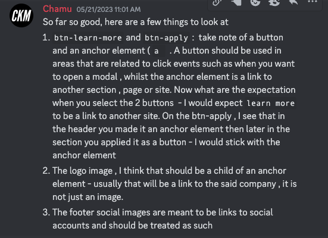

# Frontend Mentor - Workit landing page solution

This is a solution to the [Workit landing page challenge on Frontend Mentor](https://www.frontendmentor.io/challenges/workit-landing-page-2fYnyle5lu). Frontend Mentor challenges help you improve your coding skills by building realistic projects. 

## Table of contents

- [Overview](#overview)
  - [The challenge](#the-challenge)
  - [Screenshot](#screenshot)
  - [Links](#links)
- [My process](#my-process)
  - [Built with](#built-with)
  - [What I learned](#what-i-learned)
  - [Useful resources](#useful-resources)
- [Author](#author)

## Overview

### The challenge

Users should be able to:

- View the optimal layout for the interface depending on their device's screen size
- See hover and focus states for all interactive elements on the page

### Screenshot

Add a screenshot of your solution. The easiest way to do this is to use Firefox to view your project, right-click the page and select "Take a Screenshot". You can choose either a full-height screenshot or a cropped one based on how long the page is. If it's very long, it might be best to crop it.

Alternatively, you can use a tool like [FireShot](https://getfireshot.com/) to take the screenshot. FireShot has a free option, so you don't need to purchase it. 

Then crop/optimize/edit your image however you like, add it to your project, and update the file path in the image above.

### Links

- Repo URL: [Add solution URL here](https://your-solution-url.com)
- Live Site URL: [Add live site URL here](https://your-live-site-url.com)

## My process

### Built with

- Semantic HTML5 markup
- CSS custom properties
- CSS Grid
- Mobile-first workflow

### What I learned
- Having a hard time figuring out how many columns and rows to use for header grid container. There is a difference between having implicit and explicit grid. Pretty sure I would like the former which means using `minmax()` and `repeat()`

- There is a big difference between underlining a word `text-decoration: underline #44FFA1;` and using a border to underline the element that the word resides in `border-bottom: solid 0.25rem #44FFA1;`. Using a border comes closer to the design comp for this challenge. It also looks better with the larger stand out text because the spacing between the word and the line is larger and the thickness of the border can be precisely controlled.
- This challenge has curved lines at the bottom of two sections. I attempted to make this effect with SVG but I was soon going down a rabbit hole that would not get me to the finish line of completing this challenge. Went with using border-radius with a much wider width so the edge appears more subltly curved. The edge is certaily not as clean as if I did SVG.
- Button vs anchor link: Here is a response from FEM discord server from Chamu to another developer doing this same challange

### Useful resources

- [Stack Overflow-Curved Bottom](https://stackoverflow.com/questions/17040709/can-i-create-a-div-with-a-curved-bottom) - This was a good discussion on different ways to get curved bottoms on elements.
- [Example resource 2](https://www.example.com) - This is an amazing article which helped me finally understand XYZ. I'd recommend it to anyone still learning this concept.

## Author

- Website - [Amy Spencer](https://spencerproject.com/)
- Frontend Mentor - [@amyspencerproject](https://www.frontendmentor.io/profile/amyspencerproject)
- Linkedin - [amyspencercodes](https://www.linkedin.com/in/amyspencercodes/)

